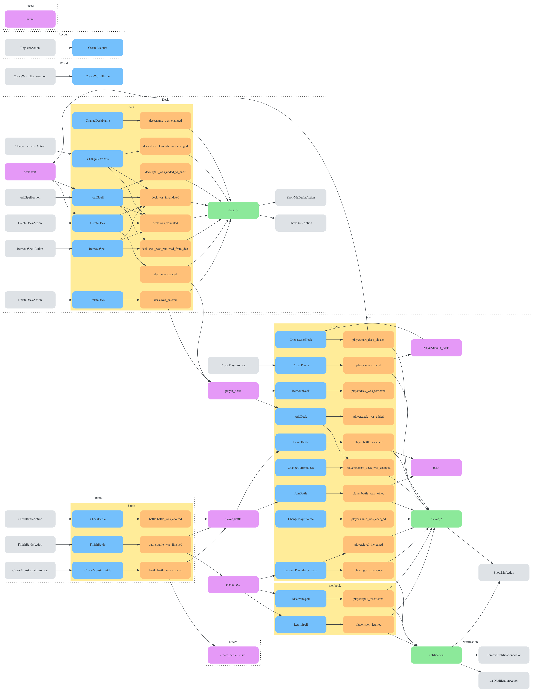

[](//packagist.org/packages/patchlevel/event-sourcing-analyser)
[](//packagist.org/packages/patchlevel/event-sourcing-analyser)

# Event Sourcing Analyser

"Visualize your event sourced domain as an Event Storming diagram, straight from your code."



## Features

* Detects [aggregates, events, commands and subscribers](https://patchlevel.dev/docs/event-sourcing-analyser/latest/event-storming) from your attributes
* Groups everything into [bounded contexts](https://patchlevel.dev/docs/event-sourcing-analyser/latest/event-storming#bounded-contexts) based on your namespaces
* Picks up [Symfony controllers](https://patchlevel.dev/docs/event-sourcing-analyser/latest/event-storming#symfony-controllers) that dispatch commands or read from projections
* Renders an Event Storming diagram with [Graphviz](https://patchlevel.dev/docs/event-sourcing-analyser/latest/output#graphviz)
* Exports the whole model as [JSON](https://patchlevel.dev/docs/event-sourcing-analyser/latest/output#json) for your own tooling

## Installation

```bash
composer require --dev patchlevel/event-sourcing-analyser
```

## Documentation

* Latest [Docs](https://patchlevel.dev/docs/event-sourcing-analyser/latest)
* Related [Blog](https://patchlevel.dev/blog)

## Integration

* [event-sourcing](https://github.com/patchlevel/event-sourcing)

## Contributing

We are open to contributions as long as they are in line with
our [BC-Policy](https://patchlevel.dev/our-backward-compatibility-promise).

Also note that the `composer.lock` is always generated with the newest supported PHP version as this is the version our tools run in the CI.
