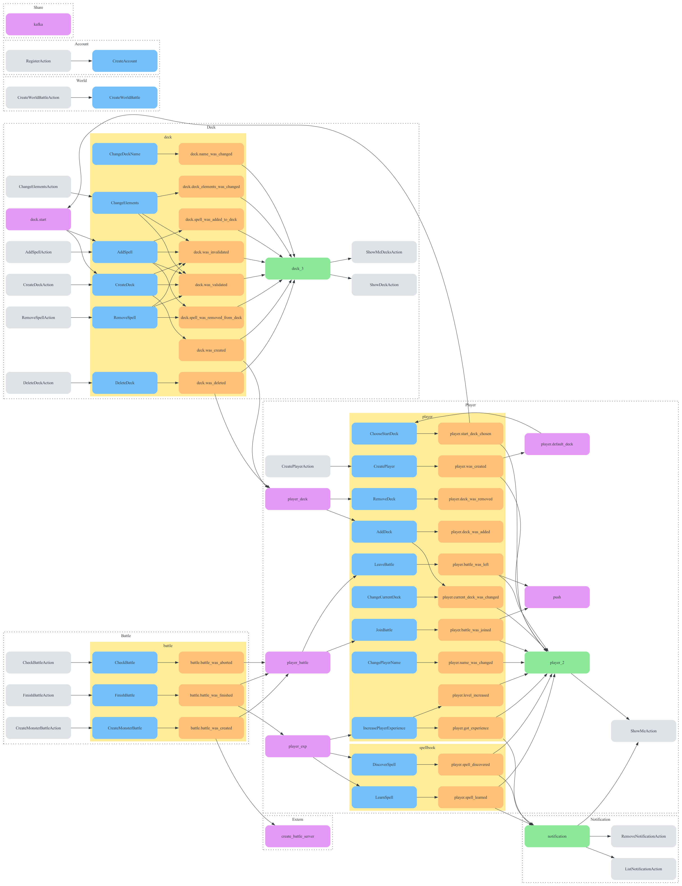

# event-sourcing-analyser (WIP)



https://agiledojo.de/2023-04-14-event-storming-notation-explained/

```bash
vendor/bin/phpstan analyse --error-format=eventSourcingGraphviz ./src | dot -Tpng > graph.png
vendor/bin/phpstan analyse --error-format=eventSourcingJson ./src > event-sourcing.json
```
